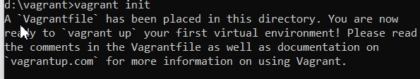
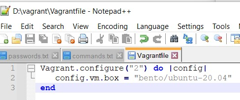
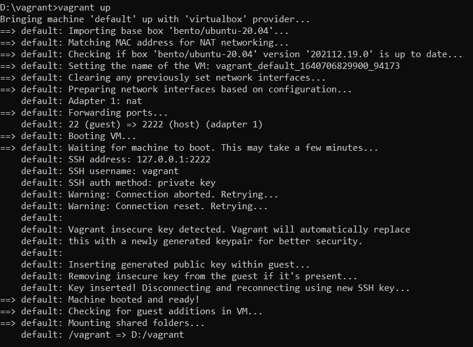
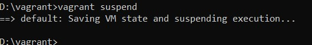
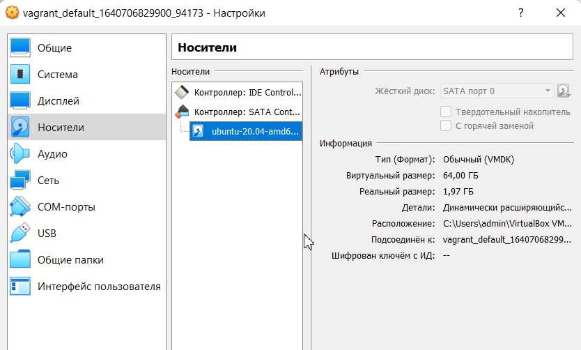
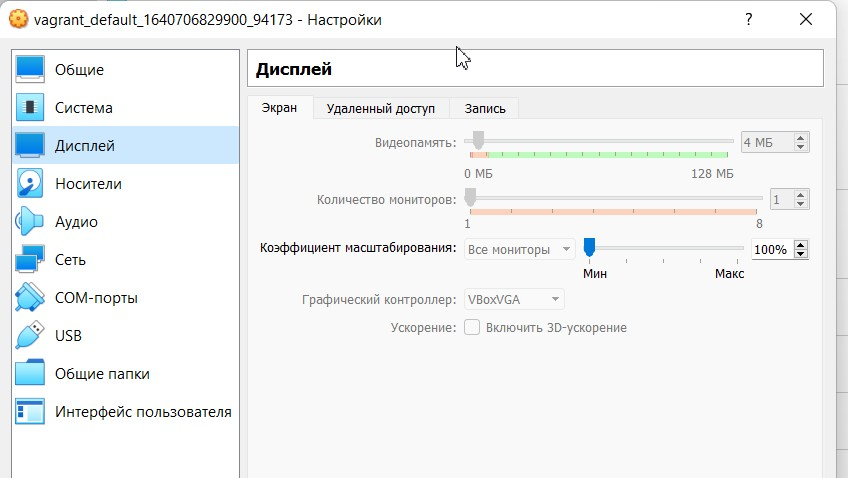
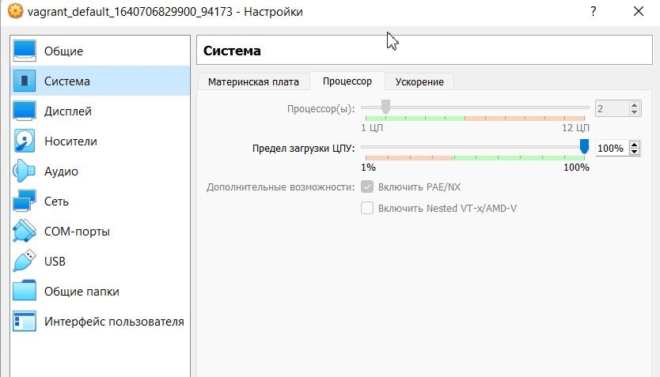
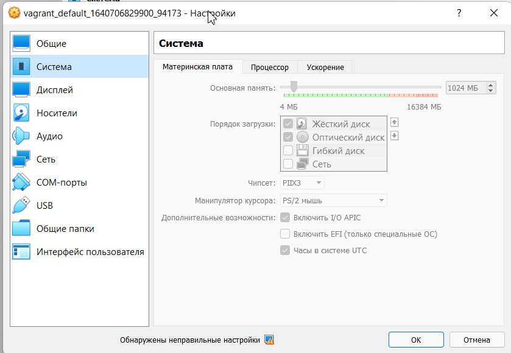
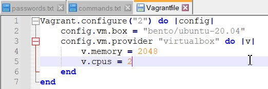
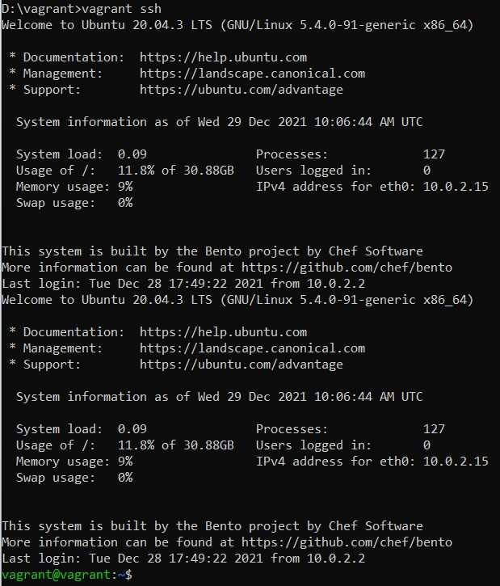

4. Выполнил инициализацию vagrant init и изменил Vagrantfile 

* vagrant up/vagrant suspend 

4. Характеристики VM 

4. Добавил оперативной памяти и CPU

4. Vagrant ssh

4. man bash

* HISTSIZE и HISTFILESIZE

* 
ignorespace — не сохранять строки начинающиеся с символа <пробел>  
ignoredups — не сохранять строки, совпадающие с последней выполненной командой  
ignoreboth — использовать обе опции ‘ignorespace’ и ‘ignoredups’  
