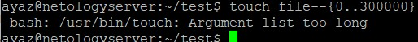

4. Выполнил инициализацию vagrant init и изменил Vagrantfile 

* vagrant up/vagrant suspend 

5. Характеристики VM 

6. Добавил оперативной памяти и CPU

7. Vagrant ssh

8. man bash

* HISTSIZE и HISTFILESIZE

* 
ignorespace — не сохранять строки начинающиеся с символа <пробел>  
ignoredups — не сохранять строки, совпадающие с последней выполненной командой  
ignoreboth — использовать обе опции ‘ignorespace’ и ‘ignoredups’ 

9. 

10. Для создания 100000 файлов написал команду touch file--{0..100000} 

 
