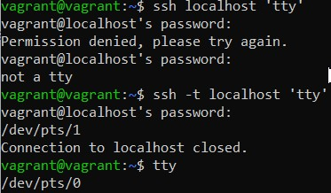

1. Встроенная/внутренняя в shell команда.
У оболочки должен обязательный минимум команд, которые должны присутствовать по умочланию, это такие команды как.
Менять директорию нужна возможность с внутренней командой, что бы лишний раз не перенапровлять запрос в shell, 
если бы она была внешней
1. grep -c
1. systemd
1. ls > /dev/pts/X
1. cat < input.txt > output.txt
1. из PTY в эмуляторов TTY 

1. создастся файл дескриптора, команда echo netology > /proc/$$/fd/5 выведет на терминал netology, 
потому что этот дескриптор будет вести на терминал
1. получится 

1. Будут выведены переменные окружения
Можно вывести командами env и printenv

1. /proc/&lt;PID&rt;/cmdline - Этот файл, доступный только для чтения, содержит полную командную строку для процесса, 
если только процесс не является зомби. 
В последнем случае в этом файле ничего нет
/proc/<PID>/exe - содержит фактический путь к исполняемому файлу, если ввести /proc/<PID>/exe, запустится копия процесса <PID>
1. наиболее старшую версию набора инструкций SSE поддерживает ваш процессор

1. насколько я понимаю так происходит потому что ssh обращается через ptmx, а не напрямую. поведение можно изменить

1. Сначала выходила ошибка, поменял в файле 10-patrace.conf
заначение kernel.yama.ptrace_scope = 0
less test.txt
ctrl-z
bg
disown less
screen
reptyr <PID>
1. Команда tee принимает на вход stdin, выводит его в stdout и записывает stdout в файл, 
т.к. она запущена от sudo, то имеет права на запись в /root
