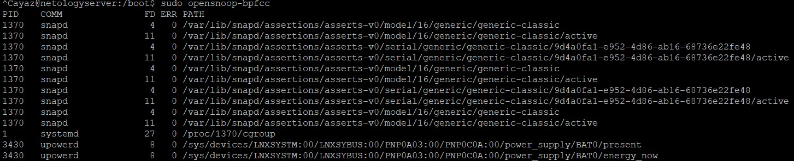

1.  
1.  

1. echo '' > /proc/<PID>/fd/<fd>
1. процесс при завершении (как нормальном, так и в результате не обрабатываемого сигнала) освобождает все свои ресурсы и становится «зомби» — 
пустой записью в таблице процессов, хранящей статус завершения, предназначенный для чтения родительским процессом.
1.  
1. системный вызов uname 

1. command1 ; command2 - запустятся обе команды и возвратит результат, даже если command1 была с ошибкой
command1 && command2 - запустятся обе команды и возвратит результат, но если command1 была с ошибкой, command2 не выполнится
смысла использовать set -e вместе с && нету. Так как set -e прирвет команду при ненулевом статусе команде
&& -  условный оператор, 
;  - разделитель последовательных команд
1. set -euxo pipefail - хорошо использовать в сценариях для дебага. Потому что вывод будет очень информативным.
e - завершить скрипт если есть команда которая завершилась с ненулевым статусом
u - рассматривайте неустановленные переменные как ошибку при замене.
x - выводит команды и их аргументы по мере их выполнения.
o pipefail - возвращает статус последней команды с ненулевым статусом или ноль, если ни одна команда не вышла с ненулевым статусом
1.  
самое большое количество S(процессы в ожидании) и I(Idle kernel thread)
доп символы показывают могут показывать Приоритет, лидера сессии, многопоточность и тд.
