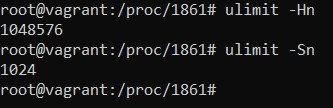

1.  
 
 
1. metrics
cpu:
node_cpu_seconds_total{cpu="0",mode="idle"} 4292.49  
node_cpu_seconds_total{cpu="0",mode="system"} 239.76  
node_cpu_seconds_total{cpu="0",mode="user"} 4.11  
memory: 
node_memory_MemAvailable_bytes  
node_memory_MemFree_bytes  
disk: 
node_disk_written_bytes_total{device="sda"} 
node_disk_read_bytes_total{device="sda"} 
network: 
node_network_receive_bytes_total{device="enp0s3"}  
node_network_transmit_bytes_total{device="enp0s3"} 
node_network_receive_errs_total{device="enp0s3"} 
node_network_transmit_errs_total{device="enp0s3"} 
1.  
 
 
1.  
 
1. этот параметр означает количество максимальное число открытых дескрипторов для ядра (системы)
 
ulimit -Hn - показывает жесткие ограничения на количество открытых дескрипторов от процесса
ulimit -Sn - показывает мягкие ограничения на количество открытых дескрипторов от процесса
 
cat /proc/sys/fs/file-max - предел операционной системы
 
1.
 
7. это fork бомба, создает множество паралельных форков самой себя
 
ulimit -u 200 - можно установить ограничения процессов от одного пользователя, на моей машине запущено ~120 процессов
