1. Это такие файлы, которые занимают меньше дискового пространства, чем их собственный размер. В файле высвобождаются области, занятые одними лишь нулями (0x00).
1. не могут потому что указывают на один и тот же inode. Одни и те же данные на диске.
1.  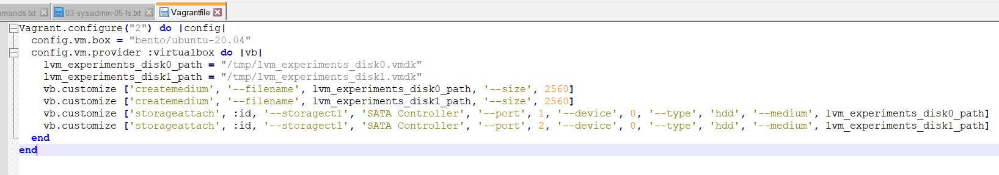
1.  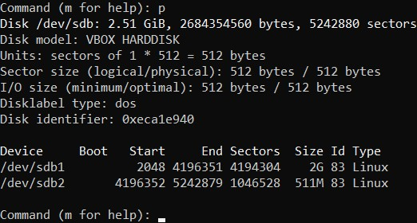
1.  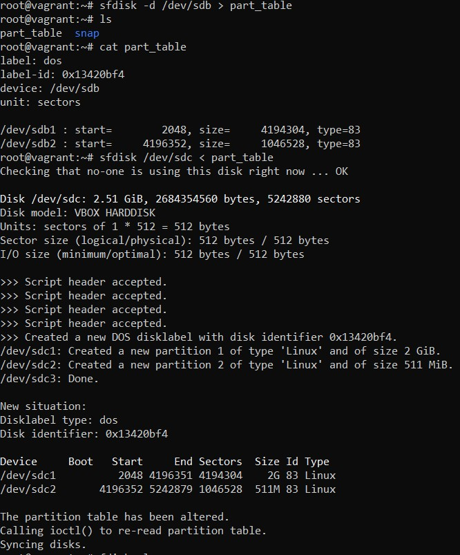
1.  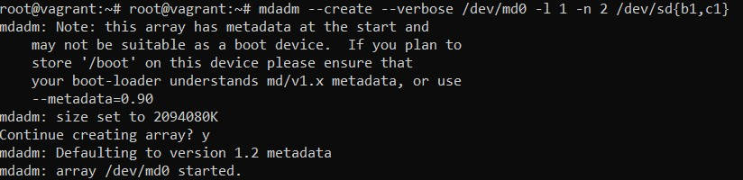
1.  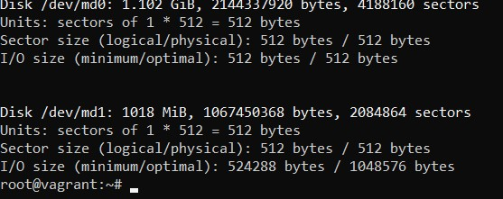
1.  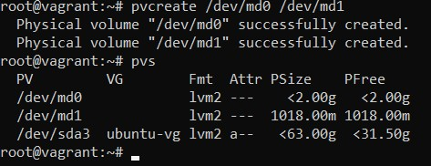
1.  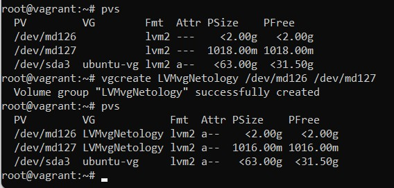
1.  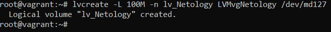
1.  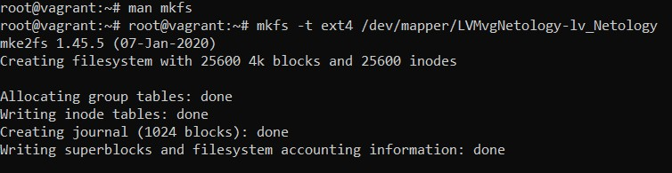
1.  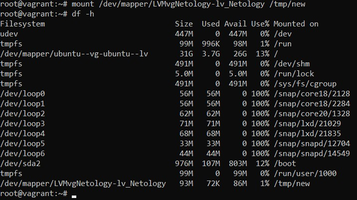
1.  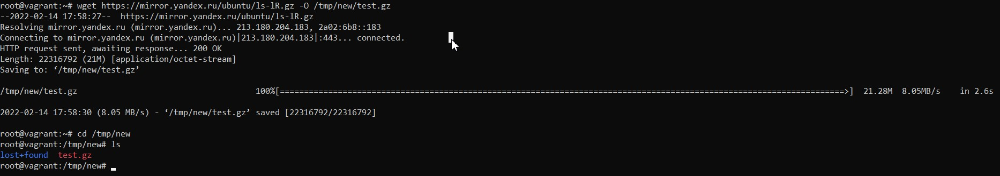
1.  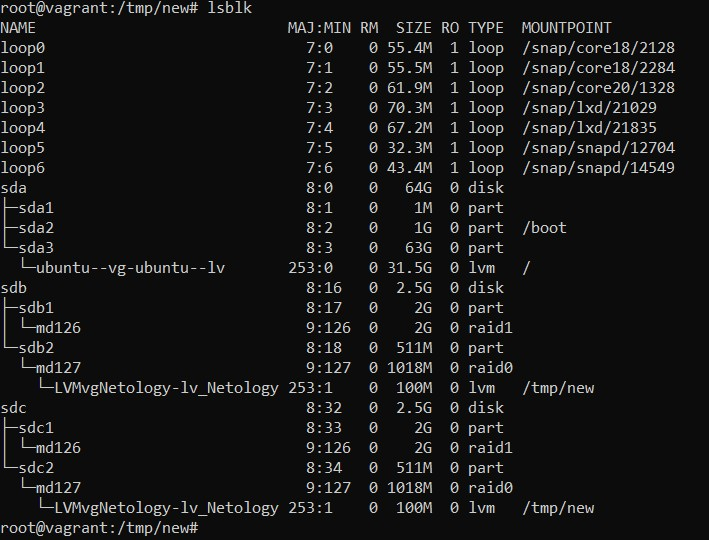
1.  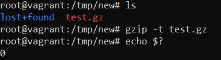
1.  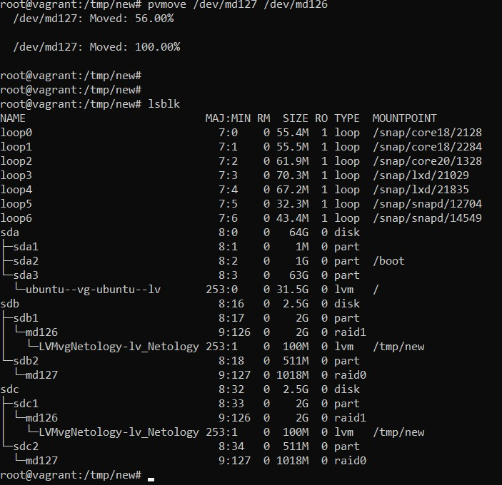
1.  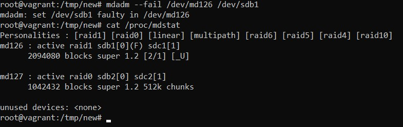
1.  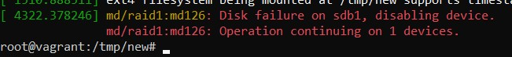
1.  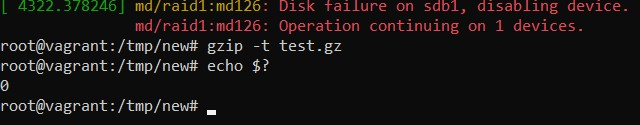
1.  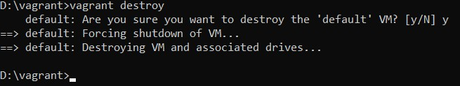
