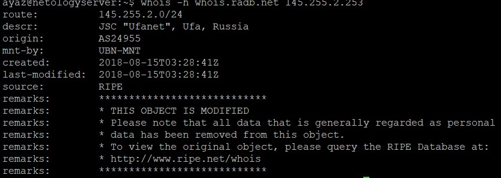

1. в ответе указываются response headers
 
1.  
 
дольше всего происходит загрузка картинок
1.  
1.  
1.  
1.  
наибольшее время ответа 43.7ms на узле 142.251.49.24
1.  
днс сервера: 
ns2.zdns.google. 
ns3.zdns.google. 
ns4.zdns.google. 
ns1.zdns.google. 
А записи: 8.8.4.4 и 8.8.8.8 
1. 