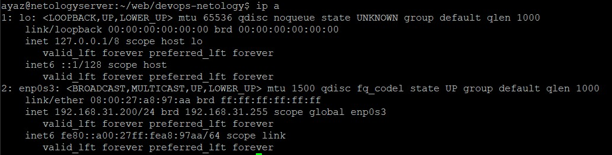
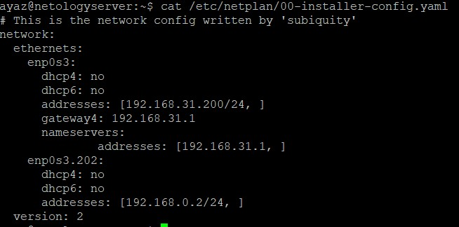
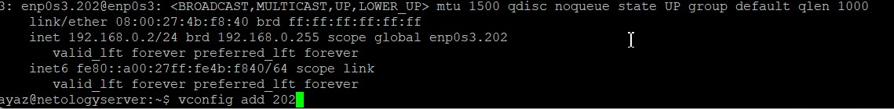
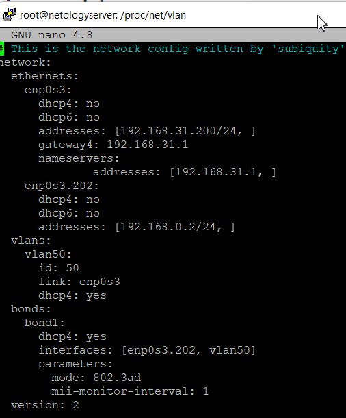
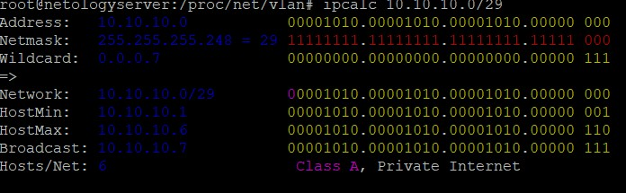
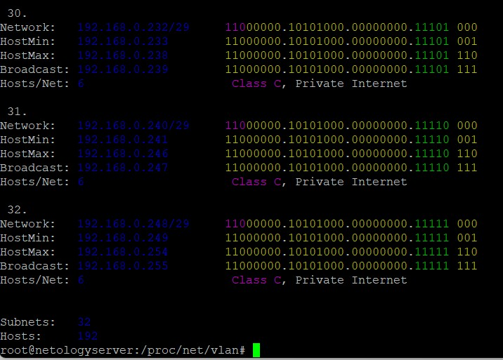
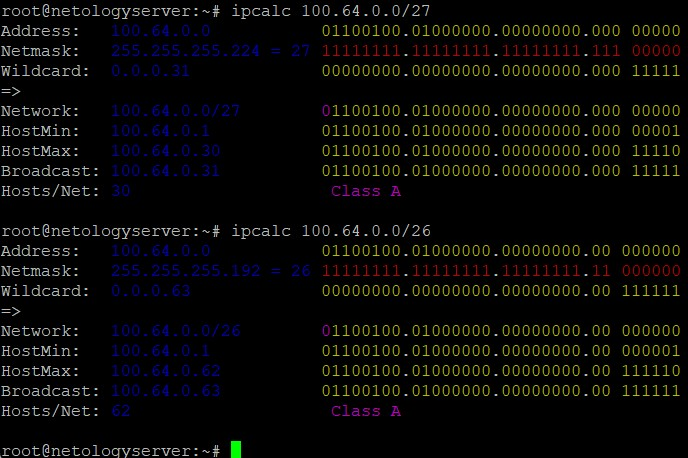

1.  
 
1. Протокол LLDP. Пакет lldpd, команда lldpctl
1. Технология VLAN. Пакет VLAN. modprobe 8021q  - установит модуль 8021q в ядро линукс. 
 Команда vconfig add 202 добавил vlan. 
 Отредактировал файл /etc/netplan/<inteface> назначил ip vlan интерфейсу. 
 Так же создал vlan через config 
 
 
1. Типы агрегаций в Linux(bond-mode):
 balance-rr 1
 active-backup 2
 balance-xor 3
 broadcast 4
 802.3ad 5 
 balance-tlb 6
 balance-alb 7
 
 mode: — указываем мод по которому будет работать bonding.
 mii-monitor-interval: — задаем интервал мониторинга 1 сек.
1.  
 ipcalc 192.168.0.1 255.255.255.0 255.255.255.248
 
 получилось 32 подсети
1. можно взять 100.64.0.0/26 (62 адреса)
  
1. windows: arp -a 
 linux: arp
 очистить arp таблицу:
 windows: arp -d * - удалить всю таблицу
 linux: ip -s neigh flush all - удалить всю таблицу
 windows: arp -d <host> - удалить нужную запись
 linux: arp -d <IP> <iface> - удалить нужную запись
