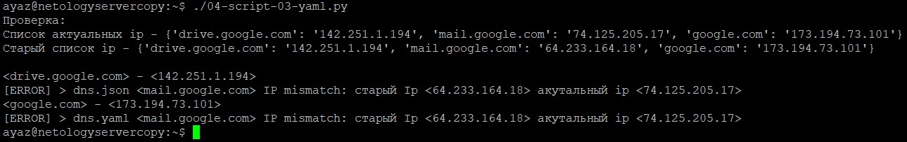
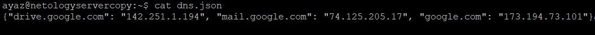
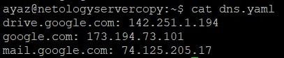

### Как сдавать задания

Вы уже изучили блок «Системы управления версиями», и начиная с этого занятия все ваши работы будут приниматься ссылками на .md-файлы, размещённые в вашем публичном репозитории.

Скопируйте в свой .md-файл содержимое этого файла; исходники можно посмотреть [здесь](https://raw.githubusercontent.com/netology-code/sysadm-homeworks/devsys10/04-script-03-yaml/README.md). Заполните недостающие части документа решением задач (заменяйте `???`, ОСТАЛЬНОЕ В ШАБЛОНЕ НЕ ТРОГАЙТЕ чтобы не сломать форматирование текста, подсветку синтаксиса и прочее, иначе можно отправиться на доработку) и отправляйте на проверку. Вместо логов можно вставить скриншоты по желани.

# Домашнее задание к занятию "4.3. Языки разметки JSON и YAML"


## Обязательная задача 1
Мы выгрузили JSON, который получили через API запрос к нашему сервису:
```
    { "info" : "Sample JSON output from our service\t",
        "elements" :[
            { "name" : "first",
            "type" : "server",
            "ip" : 7175 
            }
            { "name" : "second",
            "type" : "proxy",
            "ip : 71.78.22.43
            }
        ]
    }
```
  Нужно найти и исправить все ошибки, которые допускает наш сервис
  
Исправленный JSON
```
 { "info" : "Sample JSON output from our service\t",
        "elements" :[
            { "name" : "first",
            "type" : "server",
            "ip" : 7175
            },
            { "name" : "second",
            "type" : "proxy",
            "ip" : "71.78.22.43"
            }
        ]
 }
```

## Обязательная задача 2
В прошлый рабочий день мы создавали скрипт, позволяющий опрашивать веб-сервисы и получать их IP. К уже реализованному функционалу нам нужно добавить возможность записи JSON и YAML файлов, описывающих наши сервисы. Формат записи JSON по одному сервису: `{ "имя сервиса" : "его IP"}`. Формат записи YAML по одному сервису: `- имя сервиса: его IP`. Если в момент исполнения скрипта меняется IP у сервиса - он должен так же поменяться в yml и json файле.

### Ваш скрипт:
```python
#!/usr/bin/env python3

import socket as s
import json as jn
import os
import yaml

old_ips_json = open('dns.json', 'r+')#открываем для чтения файл со старыми ip
old_ips_yaml = open('dns.yaml', 'r+')
file_stats_json = os.stat('dns.json')
file_stats_yaml = os.stat('dns.yaml')
if file_stats_json.st_size < 2:
    old_ips_json = old_ips_json.write('{"drive.google.com":"0.0.0.0", "mail.google.com":"0.0.0.0", "google.com":"0.0.0.0"}')
if file_stats_yaml.st_size < 2:
    old_ips_yaml = old_ips_yaml('- drive.google.com: 0.0.0.0\n - mail.google.com: 0.0.0.0\n - google.com: 0.0.0.0')
stage_ipadds_json = jn.loads(old_ips_json.read())
stage_ipadds_yaml = yaml.safe_load(old_ips_yaml.read())
ip_things = []
dns_things = ["drive.google.com", "mail.google.com", "google.com"]
for host in dns_things:#цикл резолва днс в ip
    ip_things.append(s.gethostbyname(host))
current_ipadds = dict(zip(dns_things, ip_things))
file_ipadds = open('dns.json', 'w')
file_ipadds.write(jn.dumps(current_ipadds))
file_ipyaml = open('dns.yaml', 'w')
file_ipyaml.write(yaml.dump(current_ipadds))
file_ipadds.close()
file_ipyaml.close()

print('Проверка:')
print(f'Список актуальных ip - {current_ipadds}')
print(f'Старый список ip - {stage_ipadds_json}\n')

for i in current_ipadds:
    if (current_ipadds[i] == stage_ipadds_json[i]):
        print(f'<{i}> - <{current_ipadds[i]}>')
    else:
        print(f'[ERROR] > dns.json <{i}> IP mismatch: старый Ip <{stage_ipadds_json[i]}> акутальный ip <{current_ipadds[i]}>')
for j in current_ipadds:
    if (current_ipadds[j] != stage_ipadds_yaml[j]):
        print(f'[ERROR] > dns.yaml <{j}> IP mismatch: старый Ip <{stage_ipadds_yaml[j]}> акутальный ip <{current_ipadds[j]}>')
```

### Вывод скрипта при запуске при тестировании:



### json-файл(ы), который(е) записал ваш скрипт:


### yml-файл(ы), который(е) записал ваш скрипт:


## Дополнительное задание (со звездочкой*) - необязательно к выполнению

Так как команды в нашей компании никак не могут прийти к единому мнению о том, какой формат разметки данных использовать: JSON или YAML, нам нужно реализовать парсер из одного формата в другой. Он должен уметь:
   * Принимать на вход имя файла
   * Проверять формат исходного файла. Если файл не json или yml - скрипт должен остановить свою работу
   * Распознавать какой формат данных в файле. Считается, что файлы *.json и *.yml могут быть перепутаны
   * Перекодировать данные из исходного формата во второй доступный (из JSON в YAML, из YAML в JSON)
   * При обнаружении ошибки в исходном файле - указать в стандартном выводе строку с ошибкой синтаксиса и её номер
   * Полученный файл должен иметь имя исходного файла, разница в наименовании обеспечивается разницей расширения файлов

### Ваш скрипт:
```python
???
```

### Пример работы скрипта:
???
