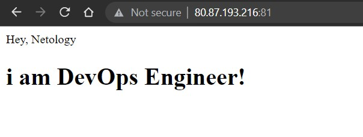
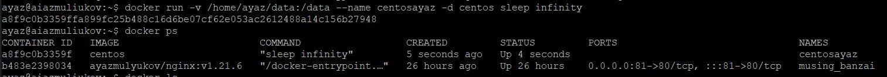
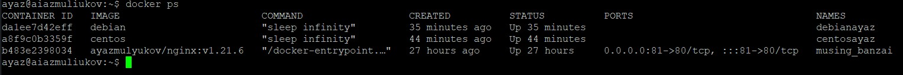
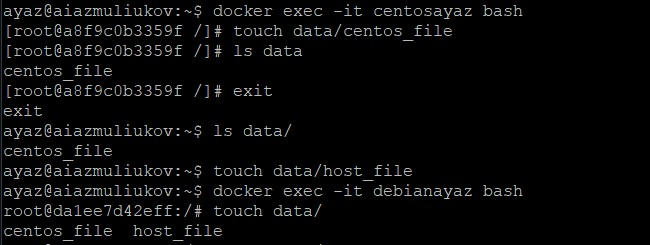

## Задача 1

Сценарий выполения задачи:

- создайте свой репозиторий на https://hub.docker.com;
- выберете любой образ, который содержит веб-сервер Nginx;
- создайте свой fork образа;
- реализуйте функциональность:
запуск веб-сервера в фоне с индекс-страницей, содержащей HTML-код ниже:
```
<html>
<head>
Hey, Netology
</head>
<body>
<h1>I’m DevOps Engineer!</h1>
</body>
</html>
```
Опубликуйте созданный форк в своем репозитории и предоставьте ответ в виде ссылки на https://hub.docker.com/username_repo.

## Решение

repository - https://hub.docker.com/repository/docker/ayazmulyukov/nginx



## Задача 2

Посмотрите на сценарий ниже и ответьте на вопрос:
"Подходит ли в этом сценарии использование Docker контейнеров или лучше подойдет виртуальная машина, физическая машина? Может быть возможны разные варианты?"

Детально опишите и обоснуйте свой выбор.

--

Сценарий:

- Высоконагруженное монолитное java веб-приложение;
- Nodejs веб-приложение;
- Мобильное приложение c версиями для Android и iOS;
- Шина данных на базе Apache Kafka;
- Elasticsearch кластер для реализации логирования продуктивного веб-приложения - три ноды elasticsearch, два logstash и две ноды kibana;
- Мониторинг-стек на базе Prometheus и Grafana;
- MongoDB, как основное хранилище данных для java-приложения;
- Gitlab сервер для реализации CI/CD процессов и приватный (закрытый) Docker Registry.

## Решение

- Высоконагруженное монолитное java веб-приложение - монолитное веб-приложение не подразумивает микросервисную архитектуру, поэтому подойдет либо физический сервер, либо виртуальный
- Nodejs веб-приложение - в зависимости от количества запросов. Если запросов много то контейнеризация лучше подойдет, 
т.к. можно добавлять контейнеры и удалить в зависимости от нагрузки. А для не большого приложения подойдет как физический сервер, так и виртуальные машины
- Мобильное приложение c версиями для Android и iOS - мобильные приложения могут только на телефонах находиться, а вот бекенд приложений может находится в контейнерах. GUI не распологается в контейнерах.
- Шина данных на базе Apache Kafka - как мне кажется нужно использовать контейнеры, т.к. сбой не так критичен, как скорость обработки очереди. Т.к. данные хранятся на отдельном хосте.
- Elasticsearch кластер для реализации логирования продуктивного веб-приложения - три ноды elasticsearch, два logstash и две ноды kibana - на официальном сайте представлены разные методы установки ELK, в том числе через образ на docker hub.
Поэтому для простоты и более отказоусточивом кластере выберем контейнеры, а так же для более быстрого развертования мониторинга и логирования.
- Мониторинг-стек на базе Prometheus и Grafana - сами сервисы не хранят данные, прометей собирает, а графана отображает, поэтому можно развернуть в контейнерах
- MongoDB, как основное хранилище данных для java-приложения - если сервис будет высоконагружен, то будут использоваться несколько нод. Т.е. будут использваться контейнеры.
- Gitlab сервер для реализации CI/CD процессов и приватный (закрытый) Docker Registry - сама суть создания своего registry подразумевает что он 
будет приватный, по этой логике я бы использовал кластер физических серверов.


## Задача 3

- Запустите первый контейнер из образа ***centos*** c любым тэгом в фоновом режиме, подключив папку ```/data``` из текущей рабочей директории на хостовой машине в ```/data``` контейнера;
- Запустите второй контейнер из образа ***debian*** в фоновом режиме, подключив папку ```/data``` из текущей рабочей директории на хостовой машине в ```/data``` контейнера;
- Подключитесь к первому контейнеру с помощью ```docker exec``` и создайте текстовый файл любого содержания в ```/data```;
- Добавьте еще один файл в папку ```/data``` на хостовой машине;
- Подключитесь во второй контейнер и отобразите листинг и содержание файлов в ```/data``` контейнера.

## Решение





## Задача 4 (*)

Воспроизвести практическую часть лекции самостоятельно.

Соберите Docker образ с Ansible, загрузите на Docker Hub и пришлите ссылку вместе с остальными ответами к задачам.

## Решение

https://hub.docker.com/repository/docker/ayazmulyukov/ansible

---

### Как cдавать задание

Выполненное домашнее задание пришлите ссылкой на .md-файл в вашем репозитории.

---
