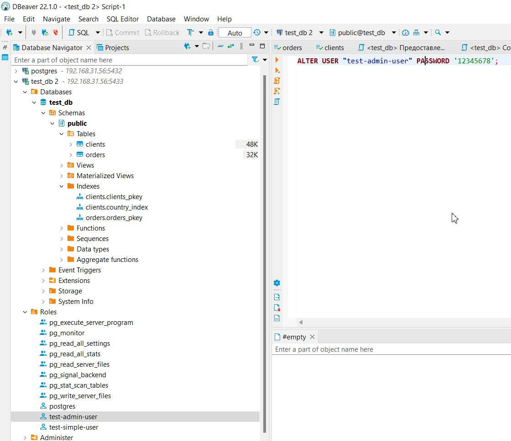

# Домашнее задание к занятию "6.2. SQL"

## Введение

Перед выполнением задания вы можете ознакомиться с 
[дополнительными материалами](https://github.com/netology-code/virt-homeworks/tree/master/additional/README.md).

## Задача 1

Используя docker поднимите инстанс PostgreSQL (версию 12) c 2 volume, 
в который будут складываться данные БД и бэкапы.

Приведите получившуюся команду или docker-compose манифест.

## Решение
```bash
ayaz@netology-coursework:~/docker$ docker pull postgres:12
12: Pulling from library/postgres
b85a868b505f: Pull complete
b53bada42f30: Pull complete
303bde9620f5: Pull complete
5c32c0c0a1b9: Pull complete
302630a57c06: Pull complete
ddfead4dfb39: Pull complete
03d9917b9309: Pull complete
4bb0d8ea11e0: Pull complete
18b4b6185066: Pull complete
9e8d0d57b0f9: Pull complete
68987ba225b7: Pull complete
297860b39beb: Pull complete
ee6b41e09bf5: Pull complete
Digest: sha256:e6ffad42c91a4d5a29257a27ac4e160c3ae7196696b37bf2e80410024ed95951
Status: Downloaded newer image for postgres:12
docker.io/library/postgres:12
ayaz@netology-coursework:~/docker$ docker volume create pg_data
pg_data
ayaz@netology-coursework:~/docker$ docker volume create pg_backup
pg_backup
ayaz@netology-coursework:~/docker$ docker run --rm --name pg-docker -e POSTGRES_PASSWORD=postgres -tid -p 5432:5432 -v pg_data:/var/lib/postgresql/data -v pg_backup:/var/lib/postgresql postgres:12
```

## Задача 2

В БД из задачи 1: 
- создайте пользователя test-admin-user и БД test_db
- в БД test_db создайте таблицу orders и clients (спeцификация таблиц ниже)
- предоставьте привилегии на все операции пользователю test-admin-user на таблицы БД test_db
- создайте пользователя test-simple-user  
- предоставьте пользователю test-simple-user права на SELECT/INSERT/UPDATE/DELETE данных таблиц БД test_db

Таблица orders:
- id (serial primary key)
- наименование (string)
- цена (integer)

Таблица clients:
- id (serial primary key)
- фамилия (string)
- страна проживания (string, index)
- заказ (foreign key orders)

Приведите:
- итоговый список БД после выполнения пунктов выше,
- описание таблиц (describe)
- SQL-запрос для выдачи списка пользователей с правами над таблицами test_db
- список пользователей с правами над таблицами test_db

## Решение
```bash
ayaz@netology-coursework:~$ psql -h 127.0.0.1 -U postgres
Password for user postgres:
psql (12.11 (Ubuntu 12.11-0ubuntu0.20.04.1))
Type "help" for help.
postgres=# CREATE DATABASE test_db;
CREATE DATABASE
postgres=# CREATE ROLE "test-admin-user" SUPERUSER NOCREATEDB NOCREATEROLE NOINHERIT LOGIN;
CREATE ROLE
postgres=# GRANT ALL ON ALL TABLES IN SCHEMA "public" TO "test-admin-user";
GRANT
postgres=# CREATE TABLE orders
postgres-# (
postgres(# id integer,
postgres(# name text,
postgres(# price integer,
postgres(# PRIMARY KEY (id)
postgres(# );
CREATE TABLE
postgres=# CREATE TABLE clients
postgres-# (
postgres(# id integer PRIMARY KEY,
postgres(# lastname text,
postgres(# country text,
postgres(# zakaz integer,
postgres(# FOREIGN KEY (zakaz) REFERENCES orders (id)
postgres(# );
CREATE TABLE
postgres=# CREATE ROLE "test-simple-user" NOSUPERUSER NOCREATEDB NOCREATEROLE NOINHERIT LOGIN;
CREATE ROLE
postgres=# GRANT SELECT ON TABLE public.clients TO "test-simple-user";
GRANT
postgres=# GRANT INSERT ON TABLE public.clients TO "test-simple-user";
GRANT
postgres=# GRANT UPDATE ON TABLE public.clients TO "test-simple-user";
GRANT
postgres=# GRANT DELETE ON TABLE public.clients TO "test-simple-user";
GRANT
postgres=# GRANT SELECT ON TABLE public.orders TO "test-simple-user";
GRANT
postgres=# GRANT INSERT ON TABLE public.orders TO "test-simple-user";
GRANT
postgres=# GRANT UPDATE ON TABLE public.orders TO "test-simple-user";
GRANT
postgres=# GRANT DELETE ON TABLE public.orders TO "test-simple-user";
GRANT
postgres=# CREATE INDEX country_index ON clients(country);
CREATE INDEX
postgres=# \l
                                 List of databases
   Name    |  Owner   | Encoding |  Collate   |   Ctype    |   Access privileges
-----------+----------+----------+------------+------------+-----------------------
 postgres  | postgres | UTF8     | en_US.utf8 | en_US.utf8 |
 template0 | postgres | UTF8     | en_US.utf8 | en_US.utf8 | =c/postgres          +
           |          |          |            |            | postgres=CTc/postgres
 template1 | postgres | UTF8     | en_US.utf8 | en_US.utf8 | =c/postgres          +
           |          |          |            |            | postgres=CTc/postgres
 test_db   | postgres | UTF8     | en_US.utf8 | en_US.utf8 |
(4 rows)
postgres=# \d orders
               Table "public.orders"
 Column |  Type   | Collation | Nullable | Default
--------+---------+-----------+----------+---------
 id     | integer |           | not null |
 name   | text    |           |          |
 price  | integer |           |          |
Indexes:
    "orders_pkey" PRIMARY KEY, btree (id)
Referenced by:
    TABLE "clients" CONSTRAINT "clients_zakaz_fkey" FOREIGN KEY (zakaz) REFERENCES orders(id)

postgres=# \d clients
               Table "public.clients"
  Column  |  Type   | Collation | Nullable | Default
----------+---------+-----------+----------+---------
 id       | integer |           | not null |
 lastname | text    |           |          |
 country  | text    |           |          |
 zakaz    | integer |           |          |
Indexes:
    "clients_pkey" PRIMARY KEY, btree (id)
    "country_index" btree (country)
Foreign-key constraints:
    "clients_zakaz_fkey" FOREIGN KEY (zakaz) REFERENCES orders(id)
postgres=# SELECT table_name, grantee, privilege_type
FROM information_schema.role_table_grants
WHERE table_name in ('clients', 'orders') AND
grantee in ('test-admin-user', 'test-simple-user');
 table_name |     grantee      | privilege_type
------------+------------------+----------------
 orders     | test-simple-user | INSERT
 orders     | test-simple-user | SELECT
 orders     | test-simple-user | UPDATE
 orders     | test-simple-user | DELETE
 orders     | test-admin-user  | INSERT
 orders     | test-admin-user  | SELECT
 orders     | test-admin-user  | UPDATE
 orders     | test-admin-user  | DELETE
 orders     | test-admin-user  | TRUNCATE
 orders     | test-admin-user  | REFERENCES
 orders     | test-admin-user  | TRIGGER
 clients    | test-simple-user | INSERT
 clients    | test-simple-user | SELECT
 clients    | test-simple-user | UPDATE
 clients    | test-simple-user | DELETE
 clients    | test-admin-user  | INSERT
 clients    | test-admin-user  | SELECT
 clients    | test-admin-user  | UPDATE
 clients    | test-admin-user  | DELETE
 clients    | test-admin-user  | TRUNCATE
 clients    | test-admin-user  | REFERENCES
 clients    | test-admin-user  | TRIGGER
(22 rows)

postgres=#
```

## Задача 3

Используя SQL синтаксис - наполните таблицы следующими тестовыми данными:

Таблица orders

|Наименование|цена|
|------------|----|
|Шоколад| 10 |
|Принтер| 3000 |
|Книга| 500 |
|Монитор| 7000|
|Гитара| 4000|

Таблица clients

|ФИО|Страна проживания|
|------------|----|
|Иванов Иван Иванович| USA |
|Петров Петр Петрович| Canada |
|Иоганн Себастьян Бах| Japan |
|Ронни Джеймс Дио| Russia|
|Ritchie Blackmore| Russia|

Используя SQL синтаксис:
- вычислите количество записей для каждой таблицы 
- приведите в ответе:
    - запросы 
    - результаты их выполнения.
	

##Решение
```
postgres=# insert into orders VALUES (1, 'Шоколад', 10), (2, 'Принтер', 3000),
(3, 'Книга', 500), (4, 'Монитор', 7000), (5, 'Гитара', 4000);
INSERT 0 5
postgres=# insert into clients VALUES (1, 'Иванов Иван Иванович', 'USA'), (2, 'Петров Петр Петрович', 'Canada'), 
(3, 'Иоганн Себастьян Бах', 'Japan'), (4, 'Ронни Джеймс Дио', 'Russia'), (5, 'Ritchie Blackmore', 'Russia');
INSERT 0 5
postgres=# select count (*) from orders;
 count
-------
     5
(1 row)

postgres=# select count (*) from clients;
 count
-------
     5
(1 row)
```

## Задача 4

Часть пользователей из таблицы clients решили оформить заказы из таблицы orders.

Используя foreign keys свяжите записи из таблиц, согласно таблице:

|ФИО|Заказ|
|------------|----|
|Иванов Иван Иванович| Книга |
|Петров Петр Петрович| Монитор |
|Иоганн Себастьян Бах| Гитара |

Приведите SQL-запросы для выполнения данных операций.

Приведите SQL-запрос для выдачи всех пользователей, которые совершили заказ, а также вывод данного запроса.
 
Подсказк - используйте директиву `UPDATE`.


##Решение

```
postgres=# update clients set zakaz = 3 where id = 1;
UPDATE 1
postgres=# update clients set zakaz = 4 where id = 2;
UPDATE 1
postgres=# update clients set zakaz = 5 where id = 3;
UPDATE 1
postgres=# select * from clients c where c.zakaz is not null;
 id |       lastname       | country | zakaz
----+----------------------+---------+-------
  1 | Иванов Иван Иванович | USA     |     3
  2 | Петров Петр Петрович | Canada  |     4
  3 | Иоганн Себастьян Бах | Japan   |     5
(3 rows)


```


## Задача 5

Получите полную информацию по выполнению запроса выдачи всех пользователей из задачи 4 
(используя директиву EXPLAIN).

Приведите получившийся результат и объясните что значат полученные значения.


##Решение

EXPLAIN - позволяет нам дать служебную информацию о запросе к БД, 
в том числе время на выполнение запроса, что при оптимизации работы БД является очень полезной информацией.

```bash
postgres=# explain select * from clients c where c.zakaz is not null;
                         QUERY PLAN
-------------------------------------------------------------
 Seq Scan on clients c  (cost=0.00..18.10 rows=806 width=72)
   Filter: (zakaz IS NOT NULL)
(2 rows)
```
В нашем случае explain показывает стоимость(cost - стоимость выполнения операции) запроса, и фильтрацию по полю zakaz != NULL.


## Задача 6

Создайте бэкап БД test_db и поместите его в volume, предназначенный для бэкапов (см. Задачу 1).

Остановите контейнер с PostgreSQL (но не удаляйте volumes).

Поднимите новый пустой контейнер с PostgreSQL.

Восстановите БД test_db в новом контейнере.

Приведите список операций, который вы применяли для бэкапа данных и восстановления. 


##Решение

```bash
ayaz@netology-coursework:~$ docker run --rm --name pg-docker-new -e POSTGRES_PASSWORD=postgres -tid -p 5433:5432 \
-v pg_data_new:/var/lib/postgresql/data -v pg_backup:/var/lib/postgresql postgres:12
ayaz@netology-coursework:~$ psql -h 127.0.0.1 -p 5433 -U postgres                                                                          
Password for user postgres:
psql (12.11 (Ubuntu 12.11-0ubuntu0.20.04.1))
Type "help" for help.

postgres=# \l
                                 List of databases
   Name    |  Owner   | Encoding |  Collate   |   Ctype    |   Access privileges
-----------+----------+----------+------------+------------+-----------------------
 postgres  | postgres | UTF8     | en_US.utf8 | en_US.utf8 |
 template0 | postgres | UTF8     | en_US.utf8 | en_US.utf8 | =c/postgres          +
           |          |          |            |            | postgres=CTc/postgres
 template1 | postgres | UTF8     | en_US.utf8 | en_US.utf8 | =c/postgres          +
           |          |          |            |            | postgres=CTc/postgres
(3 rows)

postgres=# CREATE DATABASE test_db;
CREATE DATABASE
postgres=# CREATE ROLE "test-admin-user" SUPERUSER NOCREATEDB NOCREATEROLE NOINHERIT LOGIN;
CREATE ROLE
postgres=# CREATE ROLE "test-simple-user" NOSUPERUSER NOCREATEDB NOCREATEROLE NOINHERIT LOGIN;
CREATE ROLE
postgres=# \q
ayaz@netology-coursework:~$ docker exec -it pg-docker-new bash
root@9aae680025d1:/#  psql -U postgres -d test_db < /var/lib/postgresql/backup_postgres.dmp
SET
SET
SET
SET
SET
 set_config
------------

(1 row)

SET
SET
SET
SET
SET
SET
CREATE TABLE
ALTER TABLE
CREATE TABLE
ALTER TABLE
COPY 5
COPY 5
ALTER TABLE
ALTER TABLE
CREATE INDEX
ALTER TABLE
GRANT
GRANT
GRANT
GRANT

```



---

### Как cдавать задание

Выполненное домашнее задание пришлите ссылкой на .md-файл в вашем репозитории.

---
