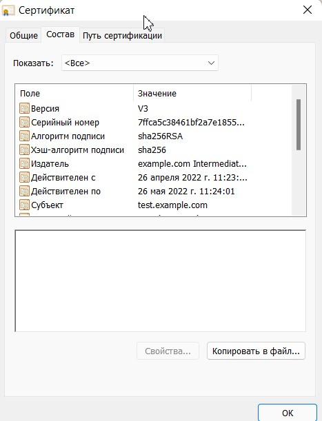

# Курсовая работа "DevOps и системное администрирование"

Задание:

Результатом курсовой работы должны быть снимки экрана или текст:
1. Процесс установки и настройки ufw
2. Процесс установки и выпуска сертификата с помощью hashicorp vault 
3. Процесс установки и настройки сервера nginx 
4. Страница сервера nginx в браузере хоста не содержит предупреждений 
5. Скрипт генерации нового сертификата работает (сертификат сервера ngnix должен быть "зеленым")
6. Crontab работает (выберите число и время так, чтобы показать что crontab запускается и делает что надо)

Решение:
## 1. Процесс установки и настройки ufw

```
sudo apt install ufw
```

```
sudo ufw default deny incoming
```

```
sudo ufw default allow outgoing
``` 

```
sudo ufw enable 
```

```
sudo ufw allow 22
```

```
sudo ufw allow 443
```

```
sudo ufw logging on medium
```

```
sudo ufw status verbose 
[sudo] password for ayaz: 
Status: active
Logging: on (low)
Default: deny (incoming), allow (outgoing), disabled (routed)
New profiles: skip

To                         Action      From
--                         ------      ----
22                         ALLOW IN    Anywhere                  
443                        ALLOW IN    Anywhere                  
22 (v6)                    ALLOW IN    Anywhere (v6)             
443 (v6)                   ALLOW IN    Anywhere (v6)             
```

## 2. Процесс установки и выпуска сертификата с помощью hashicorp vault 

Скачал с VPN bin файл по ссылке https://releases.hashicorp.com/vault/1.10.0/vault_1.10.0_linux_amd64.zip
Распоковал в /bin/usr/, дал права на выполнение.

```
vault server -dev -dev-root-token-id root
```

```
export VAULT_ADDR=http://127.0.0.1:8200
```

```
export VAULT_TOKEN=root
```


```
vault secrets enable pki
```

```
vault secrets tune -max-lease-ttl=87600h pki
```

```
vault write -field=certificate pki/root/generate/internal \
     common_name="example.com" \
     ttl=87600h > CA_cert.crt
```

```
vault write pki/config/urls \
issuing_certificates="$VAULT_ADDR/v1/pki/ca" \
crl_distribution_points="$VAULT_ADDR/v1/pki/crl"
```

```
vault secrets enable -path=pki_int pki
```

```
vault secrets tune -max-lease-ttl=43800h pki_int
```

```
vault write -format=json pki_int/intermediate/generate/internal \
     common_name="example.com Intermediate Authority" \
     | jq -r '.data.csr' > pki_intermediate.csr
```

```
vault write -format=json pki/root/sign-intermediate csr=@pki_intermediate.csr \
     format=pem_bundle ttl="43800h" \
     | jq -r '.data.certificate' > intermediate.cert.pem
```

```
vault write pki_int/intermediate/set-signed certificate=@intermediate.cert.pem
```

```
vault write pki_int/roles/example-dot-com \
     allowed_domains="example.com" \
     allow_subdomains=true \
     max_ttl="720h"
```

```
vault write pki_int/issue/example-dot-com common_name="test.example.com" ttl="24h" > certs_keys.pem
```

Далее сохранил сертификаты и приватный ключ в отдельных файлах, так же добавил в доверенные CA сертификат


## 3. Процесс установки и настройки сервера nginx 


## 4. Страница сервера nginx в браузере хоста не содержит предупреждений 


## 5. Скрипт генерации нового сертификата работает (сертификат сервера ngnix должен быть "зеленым")

```bash
#!/usr/bin/bash

/usr/bin/curl --header "X-Vault-Token: root" \
    --request POST \
    --data '{"common_name": "test.example.com", "ttl": "720h"}' \
    http://127.0.0.1:8200/v1/pki_int/issue/example-dot-com | jq >/home/ayaz/data.json

/usr/bin/jq -r '.data.certificate' /home/ayaz/data.json >/home/ayaz/cert.crt
/usr/bin/jq -r '.data.private_key' /home/ayaz/data.json >/home/ayaz/my_private.key

/usr/bin/cp /home/ayaz/cert.crt /etc/nginx/ssl/cert.crt
/usr/bin/cp /home/ayaz/my_private.key /etc/nginx/ssl/my_private.key

/usr/bin/systemctl restart nginx.service
```

## 6. Crontab работает (выберите число и время так, чтобы показать что crontab запускается и делает что надо)


*/1 * * * *  root /home/sovar/update_cert.sh - выполнение скрипта от root каждую минуту

\* 23 28 * * root  /home/sovar/update_cert.sh - выполнение скрипта от root каждый 28 день месяца в 23:00





